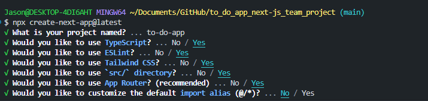
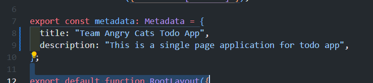
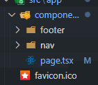
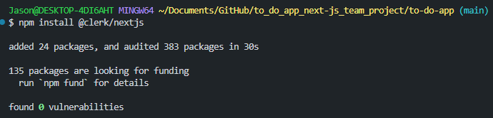
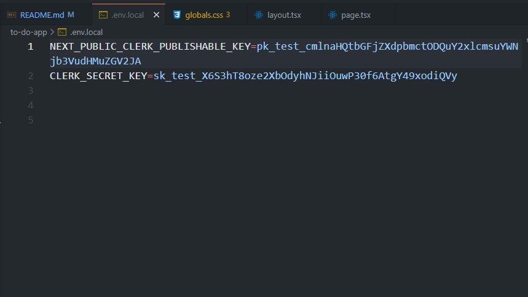
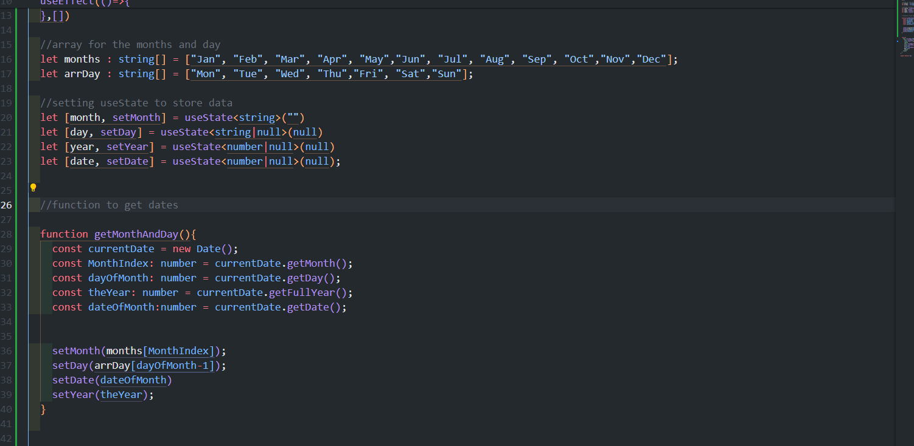
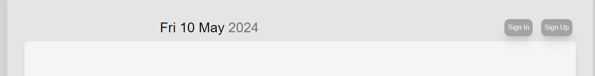

# to_do_app_next-js_team_project
 This is a team project for angry cats

# This is a team project : To do APP for Kangan Kangaroos 

### First...

To contribute to the project, first clone the repo using git, then in terminal type "npm i" 

## This project is using...

We'll be using ReactJS, NextJS, Tailwind(CSS), Strapi(Database/API), Clerk(Auth).

### things to know before...

Before we dive in, It will be helpful to understand

SSR, CSR 
JSX 
React component architecture 
React Hooks (useState, useEffect, useRef and etc but those three for sure)
JavaScript ES6 
Javascript Array Methods 
Objects

## 09/05/24

I have first set up for NextJS by typing in terminal 

 

 Goal is to create a single page application for To Do App.

 

 Then I went to src/app/layout.tsx 

 and changed the title and description.

 I'm going to create Nav bar first.

 To create a Nav bar that will be displayed the whole time regardless of the route, You first create a Nav component then import it from layout.tsx.

### Server/Client Component

 When you create client/server compoenents, You need to think about How much restriction you want for the user and SEO (Search Engine Opimisation).

When you want User to manipulate the rendering(paiting) You'll use client component.

When you want a lot of restriction and performance, You'll use Server component.

and also for SEO purpose, In general, You want big components to be server, and smaller (like nav bar, button) to be client. 

### Organising your routes

In NextJS, Unlike ReactJS, You don't need to use react-dom-router.

You can just create new folders and put page.tsx inside.

so for my Nav bar, First I'm going to create src/app/components/nav/page.tsx

### Clerk

Clerk is an Authentication Libarary for Authentication and User Management.

#### first 

install clerk 

Then You need to create .env.local file in your to-do-app 

10/05/2024

Added Date feature.

